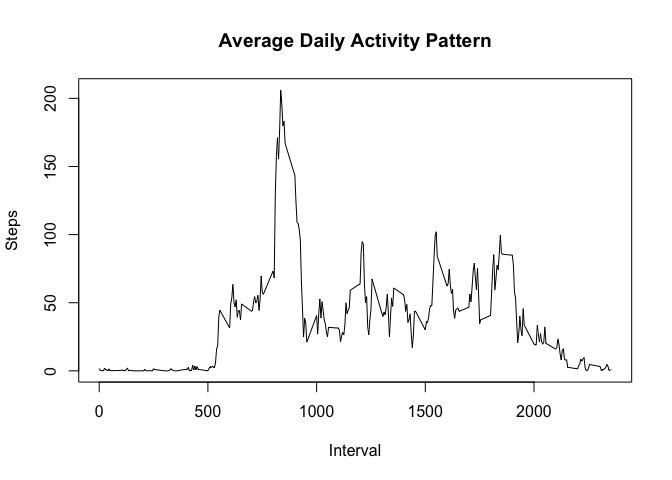
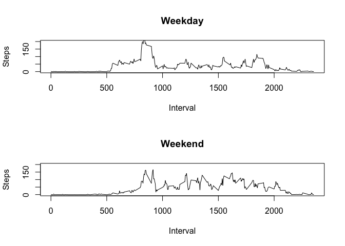

# Reproducible Research: Peer Assessment 1


## Loading and preprocessing the data


```r
if (!file.exists("activity.csv")) {
  download <- "https://d396qusza40orc.cloudfront.net/repdata%2Fdata%2Factivity.zip"
  tempfile <- "temp.zip"
  download.file(download, tempfile, method = "curl")
  unzip(tempfile)
}  

activity <- read.csv("activity.csv")
```


## What is mean total number of steps taken per day?

```r
applied <- aggregate(steps ~ date, data = activity, FUN="sum", na.rm=TRUE)
hist(applied$steps)
```

<!-- -->

### Calculate Mean and Median

```r
datamedian <- median(applied$steps)
datamean <- mean(applied$steps)
```

The mean is 1.0766189\times 10^{4} and median is 10765

## What is the average daily activity pattern?

```r
meanapplied <- aggregate(steps ~ interval, data = activity, FUN="mean", na.rm=TRUE)
plot(meanapplied$interval, meanapplied$steps, type="l")
```

<!-- -->

```r
max_interval <- meanapplied[which.max(meanapplied$steps),1]
```

The interval with the highest average steps is 835

## Imputing missing values

Because the original dataset has NA values, we will impute NA values with the mean values based on the interval.


```r
narows <- nrow(activity[is.na(activity$steps), ])
impute_data <- transform(activity, steps = ifelse(is.na(activity$steps), meanapplied$steps[match(activity$interval, meanapplied$interval)], activity$steps))
```

There are 2304 NA rows in the activity dataset.

We aggregate the values and compare with our original dataset with NAs


```r
imputeapplied <- aggregate(steps ~ date, data = impute_data, FUN="sum", na.rm=TRUE)
hist(imputeapplied$steps)
```

<!-- -->

Next we find the mean and median of the new dataset


```r
imputedmedian <- median(imputeapplied$steps)
imputedmean <- mean(imputeapplied$steps)
```

The mean is 1.0766189\times 10^{4} and median is 1.0766189\times 10^{4}. The mean values are the same, which is expected because we used the mean interval values, and the median is slightly different.

## Are there differences in activity patterns between weekdays and weekends?

First, we determine whether or not a date is a weekday or weekend


```r
impute_data$date <- as.Date(impute_data$date)
impute_data$weekday <- weekdays(impute_data$date)
weekday <- c("Monday", "Tuesday", "Wednesday", "Thursday", "Friday")
impute_data$daytype <- ifelse(impute_data$weekday %in% weekday, c("Weekday"),c("Weekend"))
impute_data$daytype <- as.factor(impute_data$daytype)
imputeapplied <- aggregate(steps ~ interval + daytype, data = impute_data, FUN=mean, na.rm=TRUE)
```

Set up a panel plot to determine whether or not weekend days are different step-wise from weekdays.


```r
Weekday <- subset(imputeapplied, daytype == 'Weekday') 
Weekend <- subset(imputeapplied, daytype == 'Weekend') 

par(mfrow=c(2,1))
plot(Weekday$interval, Weekday$steps, type="l")
plot(Weekend$interval, Weekend$steps, type="l")
```

<!-- -->
